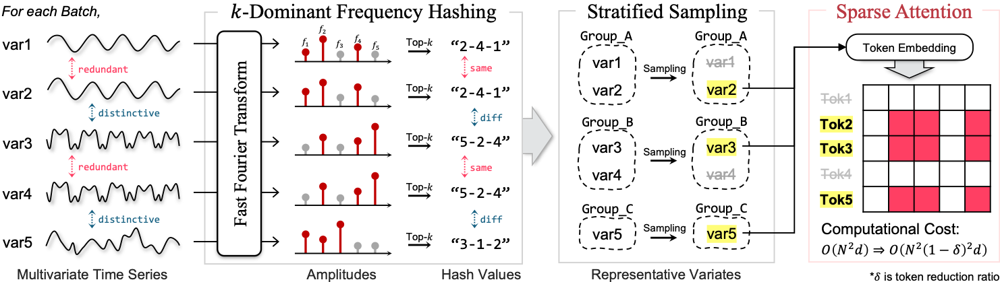

# (AAAI'25) VarDrop: Enhancing Training Efficiency by Reducing Variate Redundancy in Periodic Time Series Forecasting
[](https://ojs.aaai.org/index.php/AAAI/article/view/33951)
[](https://arxiv.org/abs/2501.14183)

> __Publication__ </br>
> Kang, J., Shin, Y., and Lee, J., "VarDrop: Enhancing Training Efficiency by Reducing Variate Redundancy in Periodic Time Series Forecasting", The 39th AAAI Conference on Artificial Intelligence (AAAI), 2025.

This repository is the official PyTorch implementation of **VarDrop**. 


## Overview
Variate tokenization, which independently embeds each variate as separate tokens, has achieved remarkable improvements in multivariate time series forecasting. However, employing self- attention with variate tokens incurs a quadratic computational cost with respect to the number of variates, thus limiting its training efficiency for large-scale applications. To address this issue, we propose VarDrop, a simple yet efficient strategy that reduces the token usage by omitting redundant variate tokens during training. VarDrop adaptively excludes redundant tokens within a given batch, thereby reducing the number of tokens used for dot-product attention while preserving essential information. Specifically, we introduce k-dominant frequency hashing (k-DFH), which utilizes the ranked dominant frequencies in the frequency domain as a hash value to efficiently group variate tokens exhibiting similar periodic behaviors. Then, only representative tokens in each group are sampled through stratified sampling. By performing sparse attention with these selected tokens, the computational cost of scaled dot-product attention is significantly alleviated. Experiments conducted on public benchmark datasets demonstrate that VarDrop outperforms existing efficient baselines. 


 
## How to run
To run the source codes, please follow the instructions below.

0. Download datasets in ```dataset``` folder. Please refer to the footnotes in the main text for access paths to each data source.

1. We require following packages to run the code. Please download all requirements in your python environment.

   ```shell
   - python==3.11.5
   - torch==2.1.1
   - numpy==1.26.2
   - scipy==1.11.4
   - scikit-learn==1.2.2
   ```

2. Run scripts in ```script``` folder.

   ```shell
   sh script/ECL.sh
   sh script/Traffic.sh
   sh script/Weather.sh
   sh script/Solar.sh
   ```


## Citation
```bibtex
@inproceedings{kang2025vardrop,
  title={VarDrop: Enhancing Training Efficiency by Reducing Variate Redundancy in Periodic Time Series Forecasting},
  author={Kang, Junhyeok and Shin, Yooju and Lee, Jae-Gil},
  booktitle={Proceedings of AAAI Conference on Artificial Intelligence},
  pages={17742--17749},
  year={2025}
}
``` 
 
 
 
 
 
 
 
 
 
 
 
 
 
 
 
 
 
 
 
 
 
 
 
 
 
 
 
 
 
 
 
 
 
 
 
 
 
 
 
 
 
 
 
 
 
 
 
 
 
 
 
 
 
 
 
 
 
 
 
 
 
 
 
 
 
 
 
 
 
 
 
 
 
 
 
 
 
 
 
 
 
 
 
 
 
 
 
 
 
 
 
 
 
 
 
 
 
 
 
 
 
 
 
 
 
 
 
 
 
 
 
 
 
 
 
 
 
 
 
 
 
 
 
 
 
 
 
 
 
 
 
 
 
 
 
 
 
 
 
 
 
 
 
 
 
 
 
 
 
 
 
 
 
 
 
 
 
 
 
 
 
 
 
 
 
 
 
 
 
 
 
 
 
 
 
 
 
 
 
 
 
 
 
 
 
 
 
 
 
 
 
 
 
 
 
 
 
 
 
 
 
 
 
 
 
 
 
 
 
 
 
 
 
 
 
 
 
 
 
 
 
 
 
 
 
 
 
 
 
 
 
 
 
 
 
 
 
 
 
 
 
 
 
 
 
 
 
 
 
 
 
 
 
 
 
 
 
 
 
 
 
 
 
 
 
 
 
 
 
 
 
 
 
 
 
 
 
 
 
 
 
 
 
 
 
 
 
 
 
 
 
 
 
 
 
 
 
 
 
 
 
 
 
 
 
